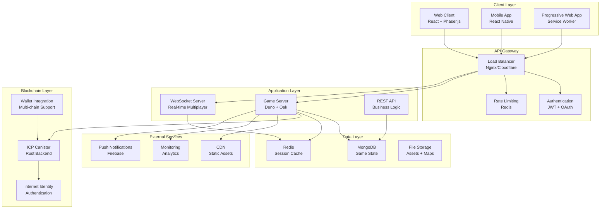

# System Architecture

## Architecture Overview

Dhaniverse employs a modern, scalable architecture that seamlessly integrates traditional web technologies with blockchain infrastructure. The system is designed for high performance, real-time multiplayer capabilities, and progressive Web3 feature adoption.



---

## Client Architecture

### Frontend Technology Stack

#### React Application (Web Client)
```typescript
// Main application structure
src/
├── components/          # Reusable UI components
│   ├── atoms/          # Basic building blocks
│   ├── molecules/      # Component combinations
│   └── organisms/      # Complex UI sections
├── game/               # Phaser.js game engine
│   ├── scenes/         # Game scenes (MainScene, MenuScene)
│   ├── entities/       # Game objects (Player, NPCs)
│   ├── systems/        # Game systems (Banking, Trading)
│   └── managers/       # Resource managers
├── services/           # API and business logic
│   ├── api/           # REST API clients
│   ├── websocket/     # Real-time communication
│   └── web3/          # Blockchain integration
├── hooks/             # Custom React hooks
├── contexts/          # React context providers
├── utils/             # Utility functions
└── types/             # TypeScript definitions
```

#### Game Engine Integration
```typescript
// Phaser.js configuration
const gameConfig: Phaser.Types.Core.GameConfig = {
  type: Phaser.AUTO,
  width: '100%',
  height: '100%',
  parent: 'game-container',
  scene: [PreloadScene, MainScene, UIScene],
  physics: {
    default: 'arcade',
    arcade: {
      gravity: { x: 0, y: 0 },
      debug: false
    }
  },
  render: {
    pixelArt: false,
    antialias: true,
    powerPreference: 'high-performance'
  }
};
```

#### State Management
```typescript
// Zustand store for global state
interface GameStore {
  // Player state
  player: PlayerState;
  updatePlayer: (updates: Partial<PlayerState>) => void;
  
  // Game state
  gameState: GameState;
  setGameState: (state: GameState) => void;
  
  // UI state
  ui: UIState;
  toggleUI: (component: string) => void;
  
  // Web3 state
  web3: Web3State;
  connectWallet: (walletType: WalletType) => Promise<void>;
}
```

### Progressive Web App Features

#### Service Worker Implementation
```typescript
// Service worker for offline functionality
self.addEventListener('install', (event) => {
  event.waitUntil(
    caches.open('dhaniverse-v1').then((cache) => {
      return cache.addAll([
        '/',
        '/static/js/bundle.js',
        '/static/css/main.css',
        '/assets/characters/',
        '/assets/maps/'
      ]);
    })
  );
});

// Background sync for offline actions
self.addEventListener('sync', (event) => {
  if (event.tag === 'game-state-sync') {
    event.waitUntil(syncGameState());
  }
});
```

#### Offline Capabilities
- **Core Gameplay**: Single-player mode works offline
- **Data Sync**: Automatic synchronization when online
- **Asset Caching**: Game assets cached for offline play
- **Progressive Enhancement**: Features gracefully degrade

---

## Backend Architecture

### Server Infrastructure

#### Deno Application Server
```typescript
// Main server configuration
import { Application, Router } from "oak";
import { oakCors } from "cors";

const app = new Application();
const router = new Router();

// Middleware stack
app.use(oakCors({
  origin: process.env.ALLOWED_ORIGINS?.split(',') || ['http://localhost:3000']
}));

app.use(async (ctx, next) => {
  const start = Date.now();
  await next();
  const ms = Date.now() - start;
  ctx.response.headers.set("X-Response-Time", `${ms}ms`);
});

// Route handlers
router.get('/api/health', healthCheck);
router.post('/api/auth/login', authenticateUser);
router.get('/api/game/state/:userId', getGameState);
router.post('/api/game/action', executeGameAction);

app.use(router.routes());
app.use(router.allowedMethods());
```

#### WebSocket Server
```typescript
// Real-time multiplayer server
interface Connection {
  id: string;
  userId: string;
  socket: WebSocket;
  authenticated: boolean;
  lastActivity: number;
  position: { x: number; y: number };
}

class WebSocketManager {
  private connections = new Map<string, Connection>();
  
  handleConnection(socket: WebSocket, request: Request) {
    const connectionId = crypto.randomUUID();
    const connection: Connection = {
      id: connectionId,
      userId: '',
      socket,
      authenticated: false,
      lastActivity: Date.now(),
      position: { x: 0, y: 0 }
    };
    
    this.connections.set(connectionId, connection);
    this.setupEventHandlers(connection);
  }
  
  broadcast(message: any, excludeId?: string) {
    const messageStr = JSON.stringify(message);
    this.connections.forEach((conn, id) => {
      if (id !== excludeId && conn.authenticated && 
          conn.socket.readyState === WebSocket.OPEN) {
        conn.socket.send(messageStr);
      }
    });
  }
}
```

### Database Architecture

#### MongoDB Schema Design
```typescript
// User document structure
interface UserDocument {
  _id: ObjectId;
  email: string;
  passwordHash: string;
  gameUsername: string;
  selectedCharacter: 'C1' | 'C2' | 'C3' | 'C4';
  createdAt: Date;
  lastLoginAt: Date;
  
  // Game-specific data
  gameData: {
    level: number;
    experience: number;
    achievements: string[];
    preferences: {
      soundEnabled: boolean;
      musicEnabled: boolean;
      language: string;
    };
  };
}

// Player state document
interface PlayerStateDocument {
  _id: ObjectId;
  userId: string;
  
  // Position and scene
  position: {
    x: number;
    y: number;
    scene: string;
  };
  
  // Financial data
  financial: {
    rupees: number;
    totalWealth: number;
    bankBalance: number;
    stockPortfolioValue: number;
  };
  
  // Inventory and progress
  inventory: {
    items: Array<{
      id: string;
      type: string;
      quantity: number;
      acquiredAt: Date;
    }>;
    capacity: number;
  };
  
  progress: {
    level: number;
    experience: number;
    unlockedBuildings: string[];
    completedTutorials: string[];
  };
  
  lastUpdated: Date;
}
```

#### Database Indexing Strategy
```javascript
// MongoDB indexes for performance
db.users.createIndex({ "email": 1 }, { unique: true });
db.users.createIndex({ "gameUsername": 1 }, { unique: true });
db.users.createIndex({ "lastLoginAt": -1 });

db.playerStates.createIndex({ "userId": 1 }, { unique: true });
db.playerStates.createIndex({ "financial.totalWealth": -1 });
db.playerStates.createIndex({ "lastUpdated": -1 });

db.transactions.createIndex({ "userId": 1, "timestamp": -1 });
db.transactions.createIndex({ "type": 1, "timestamp": -1 });

// Compound indexes for complex queries
db.leaderboards.createIndex({ 
  "category": 1, 
  "period": 1, 
  "entries.score": -1 
});
```

#### Redis Caching Strategy
```typescript
// Cache configuration
interface CacheConfig {
  sessionTTL: number;      // 24 hours
  gameStateTTL: number;    // 1 hour
  marketDataTTL: number;   // 30 seconds
  leaderboardTTL: number;  // 5 minutes
}

class CacheManager {
  private redis: Redis;
  
  async cacheGameState(userId: string, state: PlayerState) {
    const key = `game:state:${userId}`;
    await this.redis.setex(key, 3600, JSON.stringify(state));
  }
  
  async getGameState(userId: string): Promise<PlayerState | null> {
    const key = `game:state:${userId}`;
    const cached = await this.redis.get(key);
    return cached ? JSON.parse(cached) : null;
  }
  
  async cacheMarketData(data: MarketData) {
    const key = 'market:data';
    await this.redis.setex(key, 30, JSON.stringify(data));
  }
}
```

---

## Blockchain Architecture

### Internet Computer Integration

#### Canister Architecture
```rust
// Main canister structure
use ic_cdk::export_candid;
use ic_stable_structures::{StableBTreeMap, Memory, DefaultMemoryImpl};

// Stable storage for persistent data
type UserStorage = StableBTreeMap<String, UserData, Memory>;
type TransactionStorage = StableBTreeMap<String, Transaction, Memory>;

// Canister state
#[derive(Default)]
struct CanisterState {
    users: UserStorage,
    transactions: TransactionStorage,
    global_settings: GlobalSettings,
}

// Main canister functions
#[ic_cdk::update]
async fn create_user(user_data: UserData) -> Result<String, String> {
    let caller = ic_cdk::caller();
    let user_id = caller.to_string();
    
    // Validate and store user data
    STATE.with(|state| {
        let mut state = state.borrow_mut();
        state.users.insert(user_id.clone(), user_data);
    });
    
    Ok(user_id)
}

#[ic_cdk::query]
fn get_user_balance(user_id: String) -> Result<DualBalance, String> {
    STATE.with(|state| {
        let state = state.borrow();
        match state.users.get(&user_id) {
            Some(user) => Ok(user.dual_balance),
            None => Err("User not found".to_string())
        }
    })
}

export_candid!();
```

#### Web3 Integration Layer
```typescript
// Frontend Web3 service
class Web3Service {
  private agent: HttpAgent;
  private canister: ActorSubclass<_SERVICE>;
  
  constructor() {
    this.agent = new HttpAgent({
      host: process.env.NODE_ENV === 'production' 
        ? 'https://ic0.app' 
        : 'http://localhost:4943'
    });
    
    this.canister = Actor.createActor(idlFactory, {
      agent: this.agent,
      canisterId: process.env.CANISTER_ID
    });
  }
  
  async authenticateUser(walletAddress: string, signature: string) {
    try {
      const result = await this.canister.authenticate_with_signature(
        walletAddress, 
        signature
      );
      return result;
    } catch (error) {
      console.error('Authentication failed:', error);
      throw error;
    }
  }
  
  async transferTokens(to: string, amount: number) {
    try {
      const result = await this.canister.transfer_tokens(to, amount);
      return result;
    } catch (error) {
      console.error('Transfer failed:', error);
      throw error;
    }
  }
}
```

### Multi-Wallet Support

#### Wallet Connector Architecture
```typescript
// Base wallet connector interface
interface IWalletConnector {
  connect(): Promise<WalletConnection>;
  disconnect(): Promise<void>;
  signMessage(message: string): Promise<string>;
  getAccounts(): Promise<string[]>;
  isConnected(): boolean;
}

// MetaMask connector implementation
class MetaMaskConnector implements IWalletConnector {
  private provider: any;
  
  async connect(): Promise<WalletConnection> {
    if (typeof window.ethereum !== 'undefined') {
      this.provider = window.ethereum;
      const accounts = await this.provider.request({
        method: 'eth_requestAccounts'
      });
      
      return {
        address: accounts[0],
        chainId: await this.provider.request({ method: 'eth_chainId' }),
        walletType: 'metamask'
      };
    }
    throw new Error('MetaMask not installed');
  }
  
  async signMessage(message: string): Promise<string> {
    const accounts = await this.getAccounts();
    return await this.provider.request({
      method: 'personal_sign',
      params: [message, accounts[0]]
    });
  }
}

// Wallet manager
class WalletManager {
  private connectors: Map<WalletType, IWalletConnector>;
  
  constructor() {
    this.connectors = new Map([
      ['metamask', new MetaMaskConnector()],
      ['coinbase', new CoinbaseConnector()],
      ['walletconnect', new WalletConnectConnector()]
    ]);
  }
  
  async connectWallet(type: WalletType): Promise<WalletConnection> {
    const connector = this.connectors.get(type);
    if (!connector) {
      throw new Error(`Unsupported wallet type: ${type}`);
    }
    
    return await connector.connect();
  }
}
```

---

## Security Architecture

### Authentication & Authorization

#### JWT Token Management
```typescript
// JWT service implementation
class JWTService {
  private secretKey: CryptoKey;
  
  async generateToken(userId: string, username: string): Promise<string> {
    const payload = {
      userId,
      username,
      iat: Math.floor(Date.now() / 1000),
      exp: Math.floor(Date.now() / 1000) + (24 * 60 * 60) // 24 hours
    };
    
    return await create(payload, this.secretKey);
  }
  
  async verifyToken(token: string): Promise<Payload | null> {
    try {
      return await verify(token, this.secretKey);
    } catch (error) {
      console.error('JWT verification failed:', error);
      return null;
    }
  }
}
```

#### Rate Limiting
```typescript
// Redis-based rate limiting
class RateLimiter {
  private redis: Redis;
  
  async checkLimit(
    key: string, 
    limit: number, 
    window: number
  ): Promise<boolean> {
    const current = await this.redis.incr(key);
    
    if (current === 1) {
      await this.redis.expire(key, window);
    }
    
    return current <= limit;
  }
  
  // API endpoint rate limiting
  async limitAPIRequests(userId: string): Promise<boolean> {
    return this.checkLimit(`api:${userId}`, 100, 60); // 100 requests per minute
  }
  
  // Game action rate limiting
  async limitGameActions(userId: string): Promise<boolean> {
    return this.checkLimit(`game:${userId}`, 10, 1); // 10 actions per second
  }
}
```

### Data Protection

#### Input Validation
```typescript
// Zod schemas for validation
const UserRegistrationSchema = z.object({
  email: z.string().email(),
  password: z.string().min(8).max(128),
  gameUsername: z.string().min(3).max(20).regex(/^[a-zA-Z0-9_]+$/),
  selectedCharacter: z.enum(['C1', 'C2', 'C3', 'C4'])
});

const GameActionSchema = z.object({
  type: z.enum(['move', 'trade', 'deposit', 'withdraw']),
  data: z.record(z.any()),
  timestamp: z.number()
});

// Validation middleware
async function validateInput<T>(
  schema: z.ZodSchema<T>, 
  data: unknown
): Promise<T> {
  try {
    return schema.parse(data);
  } catch (error) {
    throw new ValidationError('Invalid input data', error);
  }
}
```

#### Encryption
```typescript
// Data encryption service
class EncryptionService {
  private key: CryptoKey;
  
  async encrypt(data: string): Promise<string> {
    const encoder = new TextEncoder();
    const dataBuffer = encoder.encode(data);
    
    const iv = crypto.getRandomValues(new Uint8Array(12));
    const encrypted = await crypto.subtle.encrypt(
      { name: 'AES-GCM', iv },
      this.key,
      dataBuffer
    );
    
    // Combine IV and encrypted data
    const combined = new Uint8Array(iv.length + encrypted.byteLength);
    combined.set(iv);
    combined.set(new Uint8Array(encrypted), iv.length);
    
    return btoa(String.fromCharCode(...combined));
  }
  
  async decrypt(encryptedData: string): Promise<string> {
    const combined = new Uint8Array(
      atob(encryptedData).split('').map(c => c.charCodeAt(0))
    );
    
    const iv = combined.slice(0, 12);
    const encrypted = combined.slice(12);
    
    const decrypted = await crypto.subtle.decrypt(
      { name: 'AES-GCM', iv },
      this.key,
      encrypted
    );
    
    return new TextDecoder().decode(decrypted);
  }
}
```

---

## Performance Optimization

### Frontend Optimization

#### Code Splitting
```typescript
// Route-based code splitting
const GameScene = lazy(() => import('./scenes/GameScene'));
const BankingUI = lazy(() => import('./components/BankingUI'));
const StockMarketUI = lazy(() => import('./components/StockMarketUI'));

// Component lazy loading
function App() {
  return (
    <Router>
      <Suspense fallback={<LoadingSpinner />}>
        <Routes>
          <Route path="/game" element={<GameScene />} />
          <Route path="/banking" element={<BankingUI />} />
          <Route path="/stocks" element={<StockMarketUI />} />
        </Routes>
      </Suspense>
    </Router>
  );
}
```

#### Asset Optimization
```typescript
// Map chunking system
class MapOptimizer {
  private chunkSize = 1024;
  private loadedChunks = new Map<string, HTMLImageElement>();
  
  async loadChunk(chunkId: string): Promise<HTMLImageElement> {
    if (this.loadedChunks.has(chunkId)) {
      return this.loadedChunks.get(chunkId)!;
    }
    
    const chunk = await this.fetchChunk(chunkId);
    this.loadedChunks.set(chunkId, chunk);
    
    // Implement LRU cache eviction
    if (this.loadedChunks.size > 50) {
      this.evictOldestChunk();
    }
    
    return chunk;
  }
  
  getVisibleChunks(
    cameraX: number, 
    cameraY: number, 
    viewWidth: number, 
    viewHeight: number
  ): string[] {
    // Calculate which chunks are visible
    const startX = Math.floor(cameraX / this.chunkSize);
    const startY = Math.floor(cameraY / this.chunkSize);
    const endX = Math.ceil((cameraX + viewWidth) / this.chunkSize);
    const endY = Math.ceil((cameraY + viewHeight) / this.chunkSize);
    
    const visibleChunks: string[] = [];
    for (let x = startX; x <= endX; x++) {
      for (let y = startY; y <= endY; y++) {
        visibleChunks.push(`${x}_${y}`);
      }
    }
    
    return visibleChunks;
  }
}
```

### Backend Optimization

#### Database Query Optimization
```typescript
// Optimized database queries
class GameDataService {
  async getPlayerState(userId: string): Promise<PlayerState> {
    // Use projection to limit returned fields
    const player = await db.collection('playerStates').findOne(
      { userId },
      { 
        projection: { 
          position: 1, 
          financial: 1, 
          progress: 1,
          lastUpdated: 1
        } 
      }
    );
    
    if (!player) {
      throw new Error('Player not found');
    }
    
    return player;
  }
  
  async getLeaderboard(
    category: string, 
    limit: number = 10
  ): Promise<LeaderboardEntry[]> {
    // Use aggregation pipeline for complex queries
    return await db.collection('playerStates').aggregate([
      {
        $match: { 'financial.totalWealth': { $gt: 0 } }
      },
      {
        $sort: { 'financial.totalWealth': -1 }
      },
      {
        $limit: limit
      },
      {
        $lookup: {
          from: 'users',
          localField: 'userId',
          foreignField: '_id',
          as: 'user'
        }
      },
      {
        $project: {
          userId: 1,
          username: '$user.gameUsername',
          wealth: '$financial.totalWealth',
          rank: { $add: [{ $indexOfArray: ['$$ROOT', '$_id'] }, 1] }
        }
      }
    ]).toArray();
  }
}
```

#### Connection Pooling
```typescript
// MongoDB connection management
class DatabaseManager {
  private client: MongoClient;
  private connectionPool: {
    minPoolSize: number;
    maxPoolSize: number;
    maxIdleTimeMS: number;
    serverSelectionTimeoutMS: number;
  };
  
  constructor() {
    this.connectionPool = {
      minPoolSize: 5,
      maxPoolSize: 50,
      maxIdleTimeMS: 30000,
      serverSelectionTimeoutMS: 5000
    };
  }
  
  async connect(): Promise<void> {
    this.client = new MongoClient(process.env.MONGODB_URI!, {
      ...this.connectionPool,
      retryWrites: true,
      w: 'majority'
    });
    
    await this.client.connect();
    
    // Test connection
    await this.client.db().admin().ping();
    console.log('Database connected successfully');
  }
}
```

---

## Monitoring & Analytics

### Application Monitoring
```typescript
// Performance monitoring
class PerformanceMonitor {
  private metrics = new Map<string, number[]>();
  
  recordMetric(name: string, value: number): void {
    if (!this.metrics.has(name)) {
      this.metrics.set(name, []);
    }
    
    const values = this.metrics.get(name)!;
    values.push(value);
    
    // Keep only last 1000 values
    if (values.length > 1000) {
      values.shift();
    }
  }
  
  getAverageMetric(name: string): number {
    const values = this.metrics.get(name) || [];
    if (values.length === 0) return 0;
    
    return values.reduce((sum, val) => sum + val, 0) / values.length;
  }
  
  // Middleware for request timing
  async timingMiddleware(ctx: Context, next: () => Promise<void>) {
    const start = performance.now();
    await next();
    const duration = performance.now() - start;
    
    this.recordMetric('request_duration', duration);
    this.recordMetric(`${ctx.request.method}_${ctx.request.url.pathname}`, duration);
  }
}
```

### Error Tracking
```typescript
// Error handling and reporting
class ErrorTracker {
  async reportError(error: Error, context: any): Promise<void> {
    const errorReport = {
      message: error.message,
      stack: error.stack,
      timestamp: new Date().toISOString(),
      context,
      userAgent: context.userAgent,
      userId: context.userId
    };
    
    // Log to console in development
    if (process.env.NODE_ENV === 'development') {
      console.error('Error reported:', errorReport);
    }
    
    // Send to monitoring service in production
    if (process.env.NODE_ENV === 'production') {
      await this.sendToMonitoringService(errorReport);
    }
    
    // Store in database for analysis
    await db.collection('errors').insertOne(errorReport);
  }
  
  private async sendToMonitoringService(report: any): Promise<void> {
    // Integration with services like Sentry, DataDog, etc.
    try {
      await fetch(process.env.MONITORING_ENDPOINT!, {
        method: 'POST',
        headers: { 'Content-Type': 'application/json' },
        body: JSON.stringify(report)
      });
    } catch (error) {
      console.error('Failed to send error report:', error);
    }
  }
}
```

This comprehensive system architecture provides a solid foundation for Dhaniverse's scalable, secure, and high-performance gaming platform with seamless Web3 integration.